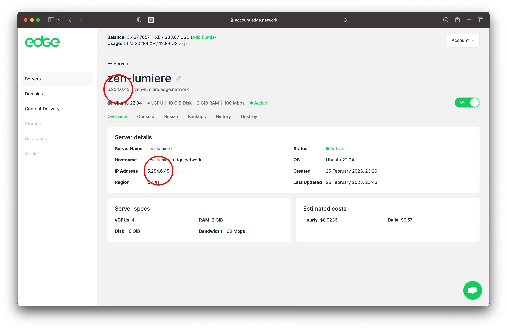

# Q\&A

How do I launch a new Edge Server

Launching an Edge Server is incredibly fast, and most deployments complete in under a minute. To launch a new Edge Server, first sign in to your Edge Account:&#x20;

[https://ed.ge/account](https://ed.ge/account)

Next, select `Serves` in the left hand menu and then click the `Deploy Server` button:

Now select the `Network Region` that you want to deploy your Edge Server within, and the `Operating System` that you want your Edge Server to run.

Then set the `Server Specs` that you need. This is the `vCPU`, `RAM`, `Disk` and `Network performance` that you want your Edge Server to have access to:

Next set a `Server Name`, `Hostname` and `Password` for your Edge Server. These can be whatever you want them to be, but they will be prepopulated with unique defaults for you. If you want to use the defaults, make sure that you copy them to somewhere safe like a password manager before you deploy you Edge Server.

And finally hit the `Deploy` button. Your Edge Server will be deployed and you will be notifed when it comes online:

Where do I find my Edge Server's public IP address?

If you do not know your Edge Server’s IP address, you can find it in your Edge Account:

What is the default username for an Edge Server?

The default username is `root` on most operating systems supported by Edge Server, including Ubuntu, Debian, CentOS and AlamaLinux.

Can I reaize an Edge Server?

Yes! Head to your servers page in the account system and select the `Resize` tab:

You can set the `Server Specs` that you need, resizing up or down from the configuration that you selected when the Edge Server was first deployed. This is the `vCPU`, `RAM`, `Disk` and `Network performance` that you want your Edge Server to have access to

How do I power down my Edge Server?

Yes. Head to your servers page in the account system and click on the `On` button towards the top right of the screen:

You will be prompted to confirm that you want to power down your Edge Server. Select `Continue` to do so:

Your Edge Server is now turned off. You can turn it back on using the same button.

How do I remove an Edge Server from my account?

Removing an Edge Server is fast adn easy. Head to your servers page in the account system, then click on the `Destroy` tab:

You will be promoted to confirm that your want to destroy the server. To do so, click `Yes, Destroy Server`:

Your Edge Server has now been removed.

How secure are Edge Servers?

Very! Edge Servers are run in conjunction with contracted companies working in partnership with Edge Network's not for profit organisation. Edge is committed to working with third-parties that maintain industry-leading security. Edge regularly audits its partner's operations to ensure that they fully implement our security, uptime and redundancy requirements.

What are some use cases for Edge Servers?

See the `Use Cases` page in the docs:&#x20;

[https://docs.edge.network/getting-started/use-cases](https://docs.edge.network/getting-started/use-cases)

