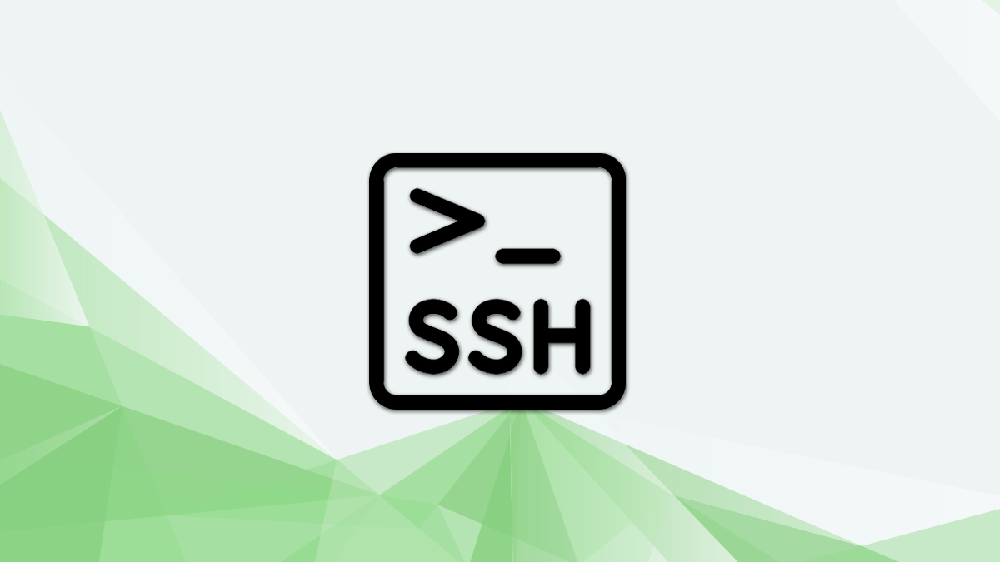

# Connect to Edge Servers with SSH

<figure><figcaption></figcaption></figure>

## Introduction

Edge Servers are Linux-based virtual machines (VMs) that run on top of decentralised & virtualised hardware. Each Edge Server you create is a new server that you can use, either standalone or as part of a larger, cloud-based infrastructure.

## Tutorial

Edge Servers are managed using a terminal and SSH. You will need to have an SSH client and, optionally, an SSH key pair. Clients generally authenticate either using passwords (which are less secure and generally not recommended) or SSH keys (which are very secure and strongly recommended).


**Tutorial in progress**

