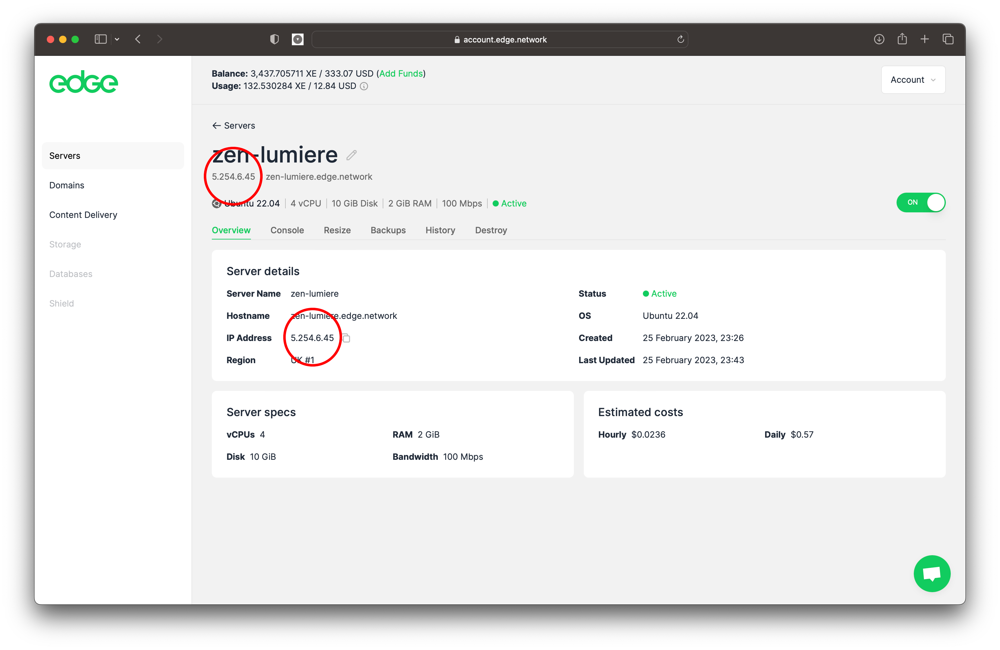

# How To Install the Apache Web Server on Ubuntu 22.04

<figure><figcaption></figcaption></figure>

## Introduction <a href="#introduction" id="introduction"></a>

This guide will teach you how to install an Apache web server on your Ubuntu 22.04 Edge Server. The Apache HTTP server is the world's most widely-used web server, offering a range of powerful features such as dynamically loadable modules, robust media support, and seamless integration with other popular software.

### Prerequisites

Before you start, you will need an Ubuntu 22.04 Edge Server with a non-**root** user with `sudo` privileges and a firewall enabled to block non-essential ports.

You can learn how to do this by following our Initial setup guide for Ubuntu 22.04.


**Page link coming soon**


Once you’re done setting this up, log in as your non-**root** user and proceed to step 1.

## Tutorial

### 1. Installing Apache

Apache is available within Ubuntu’s default software repositories, making it possible to install it using Ubuntu's standard package management tools.

Begin by updating the local package index to reflect the latest upstream changes:

```
sudo apt update
```

Then, install the `apache2` package:

```
sudo apt install apache2
```

After confirming the installation, `apt` will install Apache and all required dependencies.

### 2. Adjusting the Firewall

To test Apache, it is essential to adjust the firewall settings to permit external access to the default web ports. If you have followed the prerequisites, then your Edge Server should already have a UFW firewall in place to restrict access.

When installing Apache, it automatically registers with UFW and provides several application profiles that allow you to manage access to Apache through the firewall.

List the `ufw` application profiles by running the following:

```
sudo ufw app list
```

Your output will be a list of the application profiles:

```
OutputAvailable applications:
  Apache
  Apache Full
  Apache Secure
  OpenSSH
```

We can see that there are three profiles available for Apache:

* `Apache`: This profile opens only port `80` (normal, unencrypted web traffic)
* `Apache Full`: This profile opens both port `80` (normal, unencrypted web traffic) and port `443`(TLS/SSL encrypted traffic)
* `Apache Secure`: This profile opens only port `443` (TLS/SSL encrypted traffic)

It is recommended that you enable the most restrictive profile that will still allow the traffic you’ve configured. Since you haven’t configured SSL for your Edge Server, you’ll only need to allow traffic on port `80`:

```
sudo ufw allow 'Apache'
```

You can verify the change by checking the status:

```
sudo ufw status
```

The output will provide a list of allowed HTTP traffic:

```
OutputStatus: active

To                         Action      From
--                         ------      ----
OpenSSH                    ALLOW       Anywhere                  
Apache                     ALLOW       Anywhere                
OpenSSH (v6)               ALLOW       Anywhere (v6)             
Apache (v6)                ALLOW       Anywhere (v6)
```

We can see that the profile has been activated to allow access to the Apache web server through the firewall.

### 3. Checking your Web Server

At the end of the installation process, Ubuntu 22.04 with automatically start Apache and your web server will be up and running.

Make sure the service is active by running the command for the `systemd` init system:

```
sudo systemctl status apache2
```

```
● apache2.service - The Apache HTTP Server
     Loaded: loaded (/lib/systemd/system/apache2.service; enabled; vendor preset: enabled)
     Active: active (running) since Sat 2023-02-25 23:37:59 UTC; 1min 28s ago
       Docs: https://httpd.apache.org/docs/2.4/
   Main PID: 1500 (apache2)
      Tasks: 55 (limit: 2241)
     Memory: 5.3M
        CPU: 32ms
     CGroup: /system.slice/apache2.service
             ├─1500 /usr/sbin/apache2 -k start
             ├─1501 /usr/sbin/apache2 -k start
             └─1502 /usr/sbin/apache2 -k start
```

We can see that the service has started successfully. However, the best way to test this is to request a page from your Edge Server in your browser.

You can access the default Apache landing page to confirm that the software is running properly through your Edge Server's IP address. If you do not know your Edge Server’s IP address, you can find it in your Edge Accpunt:

<figure><figcaption></figcaption></figure>

...or you can find it from the command line by writing the following at your Edge Server’s command prompt:

```
hostname -I
```

This will return your Edge Server's IP address.

Another option is to use the free `icanhazip.com` tool. This is a website that, when accessed, returns your machine’s public IP address as read from another location on the internet:

```
curl -4 icanhazip.com
```

When you have your Edge Server’s IP address, enter it into your browser’s address bar:

```
http://your_server_ip
```

You will see the default Ubuntu 22.04 Apache web page:

<figure><figcaption></figcaption></figure>

If you can see this page, Apache is working correctly. The page also includes some basic information about important Apache files and directory locations.

### 4. Managing the Apache Process

Now that you have your web server up and running, let’s review some basic management commands using `systemctl`.

To stop your web server, run:

```
sudo systemctl stop apache2
```

To start the web server when it is stopped, run:

```
sudo systemctl start apache2
```

To stop and then start the service again, run:

```
sudo systemctl restart apache2
```

If you are simply making configuration changes, Apache can often reload without dropping active connections. To do this, use the following command:

```
sudo systemctl reload apache2
```

By default, Apache is configured to start automatically when your Edge Server boots. If this is not what you want, disable this behavior by running:

```
sudo systemctl disable apache2
```

To re-enable the service to start up at boot, run:

```
sudo systemctl enable apache2
```

Apache will now start automatically when your Edge Server boots again.

### 5. Setting Up Virtual Hosts (Recommended)

When using the Apache web server, you can use _virtual hosts_ (similar to server blocks in Nginx) to encapsulate configuration details and host more than one domain from a single server. We will set up a domain called **some\_domain**, but you should **replace this with your own domain name**.

**Info:** If you are setting up a domain name with Edge, please refer to the Edge DNS tutorials.


[Broken link](broken-reference)


Apache on Ubuntu 22.04 has one server block enabled by default that is configured to serve documents from the `/var/www/html` directory.

While this works well for a single site, it can become unwieldy if you are hosting multiple sites.

Instead of modifying `/var/www/html`, create a directory structure within `/var/www` for your **some\_domain** site, leaving `/var/www/html` in place as the default directory to be served if a client request doesn’t match any other sites.

Create the directory for **some\_domain** as follows:

```
sudo mkdir /var/www/some_domain
```

Next, assign ownership of the directory to the user you’re currently signed in as with the `$USER`environment variable:

```
sudo chown -R $USER:$USER /var/www/some_domain
```

The permissions of your web root should be correct if you haven’t modified your umask value, which sets default file permissions. To ensure that your permissions are correct and allow the owner to read, write, and execute the files while granting only read and execute permissions to groups and others, you can input the following command:

```
sudo chmod -R 755 /var/www/some_domain
```

Next, create a sample `index.html` page using `nano` or your favorite text editor:

```
sudo nano /var/www/some_domain/index.html
```

Add the following sample HTML to the file:

_/var/www/some\_domain/index.html_

```
<html>
    <head>
        <title>Welcome to some_domain!</title>
        <style>
            body { font-family: Roboto Mono,monospace; color: #0ecc5f; margin-top: 3.75rem; padding: 0 4rem; }
            h1 { margin: 0; font-size: 1.5rem; font-weight: 700; padding-bottom: .5rem; }
            p { font-weight: 400; margin: 0px; font-size: .9375rem; line-height: 1.5rem; opacity: .8; }
        </style>
    </head>
    <body>
        <h1>Success!</h1>
        <p>The some_domain virtual host is working. <a href="https://ed.ge/servers">Edge Servers</a> rock the house!</p>
    </body>
</html>
```

Save and close the file when you are finished. If you’re using `nano`, you can do this by pressing `CTRL + X`, then `Y` and then `ENTER`.

In order for Apache to serve this content, we will need to create a virtual host file with the correct directives. Instead of modifying the default configuration file located at `/etc/apache2/sites-available/000-default.conf` directly, make a new one at `/etc/apache2/sites-available/some``_domain``cons`:

```
sudo nano /etc/apache2/sites-available/some_domain.conf
```

Add in the following configuration block, which is similar to the default, but updated for your new directory and domain name:

_/etc/apache2/sites-available/some\_domain.conf_

```
<VirtualHost *:80>
    ServerAdmin webmaster@some_domain
    ServerName some_domain
    ServerAlias www.some_domain
    DocumentRoot /var/www/some_domain
    ErrorLog ${APACHE_LOG_DIR}/error.log
    CustomLog ${APACHE_LOG_DIR}/access.log combined
</VirtualHost>
```

Notice that we’ve updated the `DocumentRoot` to our new directory and `ServerAdmin` to an email that the **some\_domain** site administrator can access. We’ve also added two directives: `ServerName`, which establishes the base domain that will match this virtual host definition, and `ServerAlias`, which defines further names that will match as if they were the base name.

Save and close the file when you are finished.

Now enable the file with the `a2ensite` tool:

```
sudo a2ensite some_domain.conf
```

Disable the default site defined in `000-default.conf`:

```
sudo a2dissite 000-default.conf
```

Next, test for configuration errors:

```
sudo apache2ctl configtest
```

You should receive the following output:

```
Syntax OK
```

Restart Apache to implement your changes:

```
sudo systemctl restart apache2
```

Apache will now be serving your domain name. You can test this by navigating to `http://some``_domain`, where you will see the following:

<figure><figcaption></figcaption></figure>

### 6. Familiarising Yourself with Apache Files and Directories

Now that you know how to manage the Apache service itself, you should take a few minutes to familiarise yourself with a few important directories and files.

#### Content

* `/var/www/html`: The actual web content, which by default only consists of the default Apache page you saw earlier, is served out of the `/var/www/html` directory. This can be changed by altering Apache's configuration files.

#### Server Configuration

* `/etc/apache2`: The Apache configuration directory. All of Apache's configuration files reside here.
* `/etc/apache2/apache2.conf`: The main Apache configuration file. This can be modified to make changes to Apache's global configuration. This file is responsible for loading many of the other files in the configuration directory.
* `/etc/apache2/ports.conf`: This file specifies the ports that Apache will listen on. By default, Apache listens on port `80` and additionally listens on port `443` when a module providing SSL capabilities is enabled.
* `/etc/apache2/sites-available`: The directory where per-site virtual hosts can be stored. Apache will not use the configuration files found in this directory unless they are linked to the `sites-enabled` directory. Typically, all server block configuration is done in this directory and then enabled by linking to the other directory with the `a2ensite` command.
* `/etc/apache2/sites-enabled`: The directory where enabled per-site virtual hosts are stored. Typically, these are created by linking to configuration files found in the `sites-available`directory with the `a2ensite`. Apache reads the configuration files and links found in this directory when it starts or reloads to compile a complete configuration.
* `/etc/apache2/conf-available`, `/etc/apache2/conf-enabled`: These directories have the same relationship as the `sites-available` and `sites-enabled` directories but are used to store configuration fragments that do not belong in a virtual host. Files in the `conf-available`directory can be enabled with the `a2enconf` command and disabled with the `a2disconf`command.
* `/etc/apache2/mods-available`, `/etc/apache2/mods-enabled`: These directories contain the available and enabled modules, respectively. Files ending in `.load` contain fragments to load specific modules, while files ending in `.conf` contain the configuration for those modules. Modules can be enabled and disabled using the `a2enmod` and `a2dismod` commands.

#### Server Logs

* `/var/log/apache2/access.log`: By default, every request to your web server is recorded in this log file unless Apache is configured to do otherwise.
* `/var/log/apache2/error.log`: By default, all errors are recorded in this file. The `LogLevel`directive in the Apache configuration specifies how much detail the error logs will contain.

### Conclusion

Now that you have Apache installed on your Edge Server, you have many options for the type of content that you can serve, and the technologies that you can use.

If you’d like to build out a more complete web application stack, you can read this article on how to configure a LAMP stack on Ubuntu 22.04:


**Page link coming soon**

