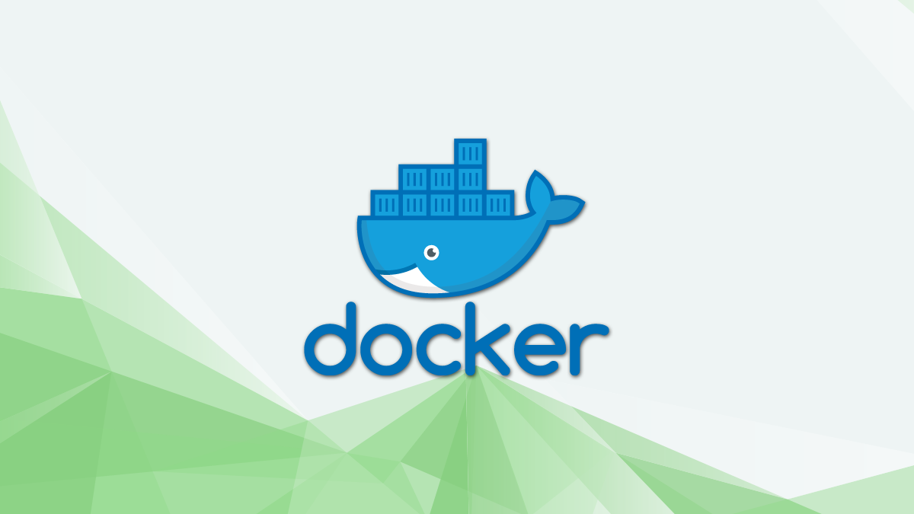

# Installation and Basic Usage of Docker on Ubuntu 22.04

<figure><figcaption></figcaption></figure>

## Introduction <a href="#introduction" id="introduction"></a>

Docker is an application that simplifies managing application processes in containers. Containers are similar to virtual machines but are more portable, resource-friendly, and dependent on the host operating system. This tutorial will guide you through installing and using Docker Community Edition (CE) on Ubuntu 22.04, working with containers and images, and pushing an image to a Docker Repository.

_Note: This tutorial will probably also work for other versions of ubuntu. It may also work for other linux distributions with slight modifications to the install commands_

### Prerequisites

Before you start, you will need an Ubuntu 22.04 Edge Server with a non-**root** user with `sudo` privileges and a firewall enabled to block non-essential ports.

You can learn how to do this by following our base configuration tutorial for Ubuntu 22.04:


[base-configuration-for-ubuntu-22.04.md](base-configuration-for-ubuntu-22.04.md)


Once you’re done setting this up, log in as your non-**root** user and proceed to step 1.

## Tutorial

### 1. Installing Docker

To install the latest version of Docker from the official Docker repository, you'll need to add a new package source, add the GPG key from Docker to ensure the downloads are valid, and then install the package. Follow the steps below to do this:

Update your existing list of packages:

```
sudo apt update
```

Install the prerequisite packages that let apt use packages over HTTPS:

```
sudo apt install apt-transport-https ca-certificates curl software-properties-common
```

Add the GPG key for the official Docker repository to your system:

```
curl -fsSL https://download.docker.com/linux/ubuntu/gpg | sudo gpg --dearmor -o /usr/share/keyrings/docker-archive-keyring.gpg
```

Add the Docker repository to APT sources:

```
echo "deb [arch=$(dpkg --print-architecture) signed-by=/usr/share/keyrings/docker-archive-keyring.gpg] https://download.docker.com/linux/ubuntu $(lsb_release -cs) stable" | sudo tee /etc/apt/sources.list.d/docker.list > /dev/null
```

Update your existing list of packages again for the addition to be recognized:

```
sudo apt update
```

Confirm that you are about to install from the Docker repository instead of the default Ubuntu repository:

```
apt-cache policy docker-ce
```

You'll see output similar to the following, although the version number for Docker may be different:

```
docker-ce:
  Installed: (none)
  Candidate: 5:20.10.14~3-0~ubuntu-jammy
  Version table:
     5:20.10.14~3-0~ubuntu-jammy 500
        500 https://download.docker.com/linux/ubuntu jammy/stable amd64 Packages
     5:20.10.13~3-0~ubuntu-jammy 500
        500 https://download.docker.com/linux/ubuntu jammy/stable amd64 Packages
```

Notice that docker-ce is not installed, but the candidate for installation is from the Docker repository for Ubuntu 22.04 (jammy).

After following the previous steps, you are ready to install Docker on your Ubuntu 22.04 `edge server`. To do this, run the following command:

```
sudo apt install docker-ce
```

This command will install Docker on your system, start the Docker daemon, and enable it to start on boot. You can verify that Docker is running by checking its status:

```
sudo systemctl status docker
```

The output should show that the service is active and running.

Once Docker is installed, you will have access not only to the Docker service (daemon) but also to the docker command line utility, or Docker client. We will explore how to use the docker command in the later sections of this tutorial.

### 2. Running Docker as Non-Root

By default, only the **root** user or users in the docker group can run the docker command. If you try to run the docker command without prefixing it with sudo or without being in the docker group, you will see an error message like this:

```
docker: Cannot connect to the Docker daemon. Is the docker daemon running on this host?.
See 'docker run --help'.
```

To avoid typing sudo every time you run the docker command, you can add your user to the docker group by running the following command:

```
sudo usermod -aG docker ${USER}
```

After adding your user to the docker group, you need to log out of the `edge server` and log back in to apply the new group membership. Alternatively, you can use the following command:

```
su - ${USER}
```

This will prompt you to enter your user's password to continue.

You can confirm that your user is now added to the docker group by typing:

```
groups
```

You should see output similar to this:

```
max sudo docker
```

Note that the rest of this tutorial assumes that you are running the docker command as a user in the docker group. If you choose not to add your user to the docker group, you will need to prepend the docker command with sudo every time you run it.

### 3. Running a Container in Docker

Docker containers rely on Docker images, which can be retrieved from Docker Hub. Docker Hub is a Docker registry managed by Docker. Anyone can host their Docker images on Docker Hub, making it a popular location for hosting images for various applications and Linux distributions.

To verify that your system can access and download images from Docker Hub, execute the following command:

```
docker run hello-world
```

The output of this command will confirm that Docker is installed correctly and has access to Docker Hub. Initially, Docker will attempt to locate the "hello-world" image locally. Since it is not found, Docker will download the image from Docker Hub, which is the default repository. Once the image is downloaded, Docker will create a container from the image, and the application within the container will execute, displaying the "Hello from Docker!" message.

You can use the docker command with the search subcommand to explore the images that are available on Docker Hub. For example, to find a linux alpine image, type the following command:

```
sudo docker search alpine
---
NAME                               DESCRIPTION                                     STARS     OFFICIAL   AUTOMATED
alpine                             A minimal Docker image based on Alpine Linux…   9727      [OK]       
alpinelinux/docker-cli             Simple and lightweight Alpine Linux image wi…   7                    
alpinelinux/gitlab-runner          Alpine Linux gitlab-runner (supports more ar…   4                    
alpinelinux/alpine-gitlab-ci       Build Alpine Linux packages with Gitlab CI      3                    
alpinelinux/gitlab                 Alpine Linux based Gitlab image                 2                    
grafana/alpine                     Alpine Linux with ca-certificates package in…   2                    
alpinelinux/gitlab-runner-helper   Helper image container gitlab-runner-helper …   2                    
...                
```

This will provide a list of available images related to linux alpine, along with their respective names, descriptions, and other details.

In the "OFFICIAL" column of the search results, the "OK" status indicates an image that has been built and supported by the organization behind the project. Once you've identified the image you need, you can download it to your computer using the "pull" subcommand.

To download the official alpine image to your computer, run the following command:

```
docker pull alpine
```

This command will retrieve the latest version of the alpine image from Docker Hub and download it to your local machine. The process may take a few minutes, depending on the size of the image and your internet connection speed. Once the download is complete, you can start working with the alpine image using Docker.

Alpine is a very lightweight linux distribution that only carries the bare necessities, making it perfect for launching lightweight containers.

Once you have downloaded an image, you can use the "run" subcommand to launch a container using that image. Similar to the "hello-world" example, if the image is not already downloaded, Docker will first retrieve it before launching a container using it.

To view the images that have been downloaded to your system, run the following command:

```
docker images
```

This command will display a list of all the images that have been downloaded to your computer, along with their respective repository, tag, and size. You can use this list to verify that the image you downloaded is available and to keep track of the disk space used by your Docker images.

### 4. Interactive Container Access

In the previous hello world step, we ran a simple container, but containers can be much more powerful and interactive. They are like virtual machines but more efficient. Let's run a container using the latest Ubuntu image as an example. We can use the `-i` and `-t` switches to get interactive shell access into the container. This will change your command prompt to reflect that you're now inside the container.

```
docker run -it alpine
```

Once inside the container, you can run any command. For example, you can update the package database and install Node.js. `apk` is the package manager of alpine linux in this case. Any changes you make inside the container will only apply to that container.

```
apk add nodejs
```

After using Docker for a while, you'll have many active and inactive containers on your computer. You can view the active ones using `docker ps`. To view all containers, including inactive ones, use `docker ps -a`. You can start and stop containers using `docker start` and `docker stop`. When you're done with a container, you can remove it with `docker rm`.

You can also create new images based on changes you make in a container. After installing Node.js in the Ubuntu container, you might want to reuse it later as a basis for new images. You can commit the changes to a new Docker image instance using the `docker commit` command. This creates a new image that is saved locally on your computer. You can later push this image to a Docker registry like Docker Hub so others can access it.

### Conclusion

In conclusion, Docker is a powerful tool for managing containers and images, and this tutorial has provided a basic introduction to its installation and usage. However, there is a extremely large wealth of possibilities and features to further explore. To further enhance your understanding of Docker, it is recommended to read more tutorials and documentation available on the official Docker page.


