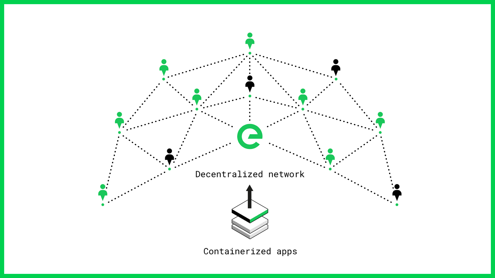
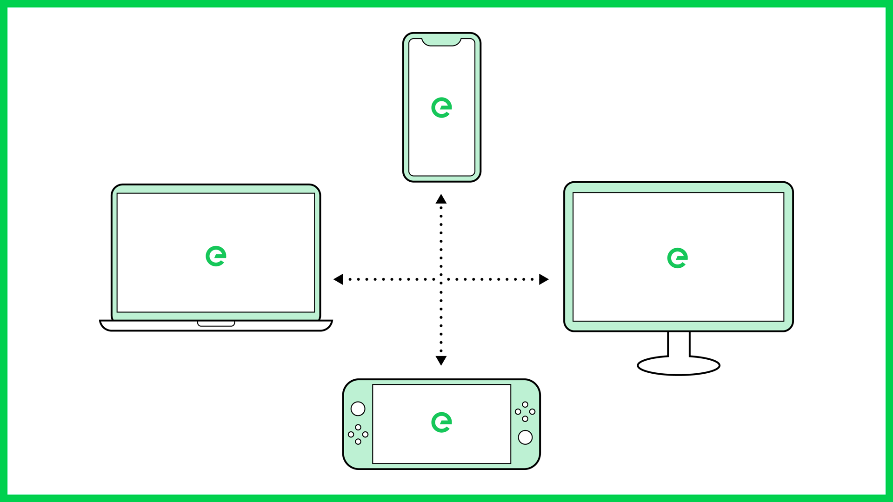
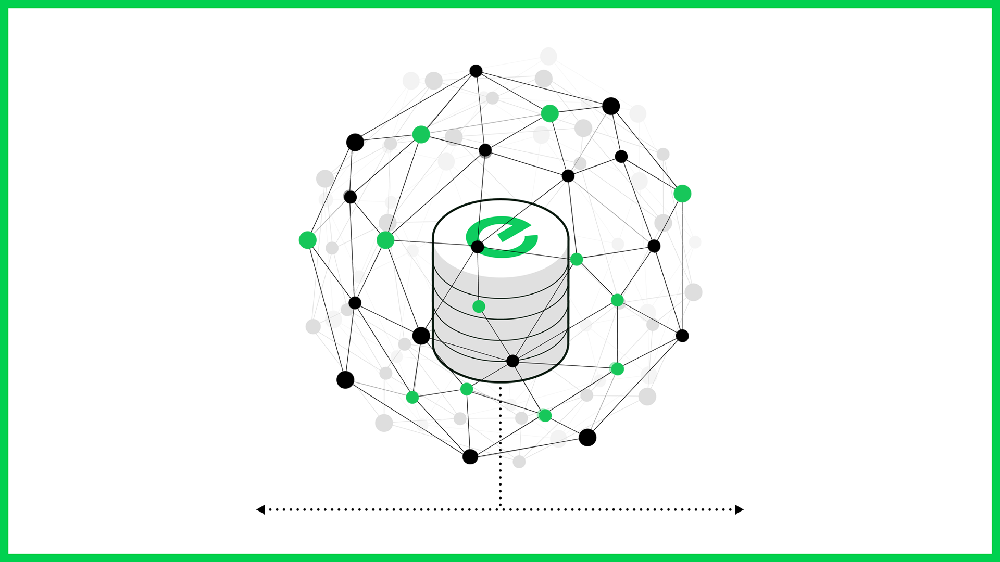
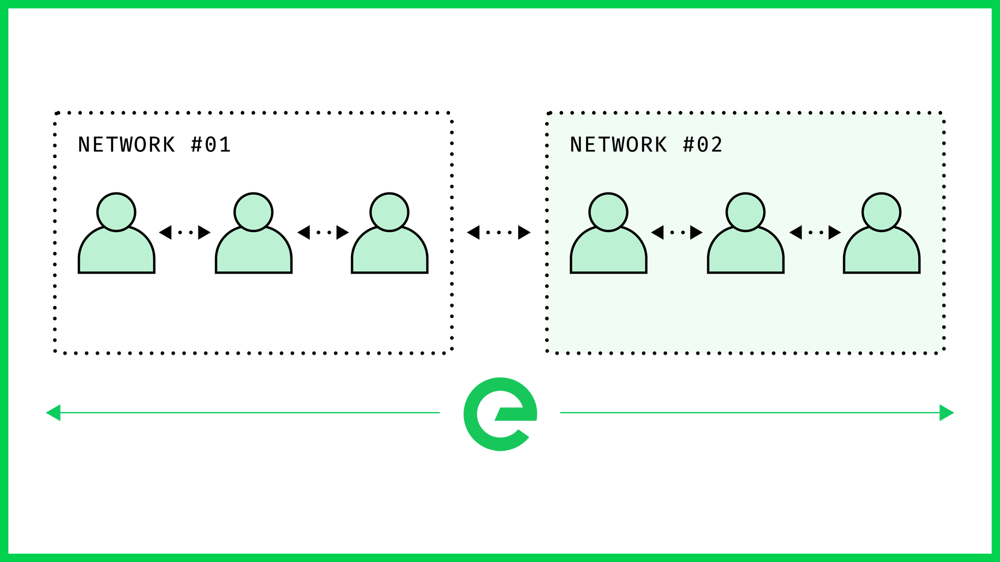
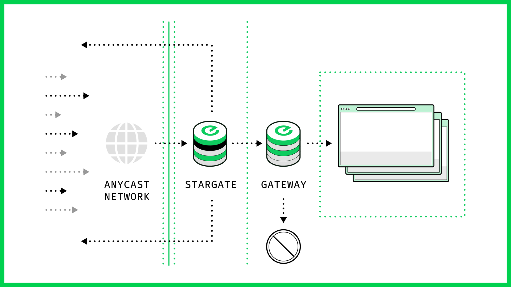

# 🌐 Network Introduction

## What is Edge Networking?

Edge networking is a distributed computing paradigm which brings data storage and computation as close to the point of need as possible, pushing applications, data and computing power away from centralised data centres.

This reduces the volumes of data that must be moved, the consequent traffic, and the distance the data must travel, providing lower latency and reduced transmission costs.

<figure><figcaption></figcaption></figure>

## Network Architecture

The network's novel architecture has multiple node types that enable the connectivity of devices in multifarious network settings.

### The Local Global Network

Edge comprises hundreds of nodes contributed by individuals and businesses around the world. It is designed to provide hyper-local processing and storage capacity for networked applications, enabling digital services that are more performant than ever before.

Edge's technology harnesses the spare capacity that exists in the devices all around us. Take for example set top boxes, which are turned on 24/7, but only in use for an average of a few hours every day. In isolation a set top box doesn’t provide that much power, but when you knit the 35 million devices installed in homes in the UK it becomes an incredibly powerful resource.

<figure><figcaption></figcaption></figure>

### BGP Routing

The Edge network utilizes BGP (Border Gateway Protocol) operating within network masternodes to inform top level routing decisions in the network. BGP is the protocol that makes the Internet work. It does this by enabling data routing on the Internet by looking at all of the available paths that data could take from point to point, and picking the best route.

<figure><figcaption></figcaption></figure>

### Internal Network Routing

Edge is network aware, and capable of routing within local networks to minimise the hops involved in any given request.

If you are a network owner or have a significant hardware estate, you can offset the cost of network services by contributing to the network. In addition, by enabling delivery within your own network, you can reduce north-south transport, effectively converting it to east-west transport between devices and end users within your own estate.

<figure><figcaption></figcaption></figure>

### Security

Denial of Service attacks continue to escalate in scope, becoming ever more distributed, with growing volumes of traffic. Attacks increase your cost and impact your revenues, customer experience and brand.

Edge’s layered approach to security effectively defends against DDoS attacks, preventing disruption to your core services, and keeping your apps online

<figure><figcaption></figcaption></figure>

## Additional Reading

These links are designed to enable you to delve deeper in to the Edge network:

* Network Coverage: [edge.network/en/global-reach](https://edge.network/en/global-reach/)
* Security: [edge.network/en/security](https://edge.network/en/security/)
* Monitoring: [edge.network/en/monitoring](https://edge.network/en/monitoring/)
* DDoS Protection: [edge.network/en/ddos-protection](https://edge.network/en/ddos-protection/)
